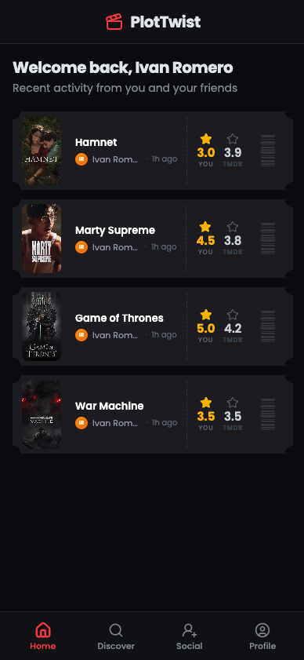
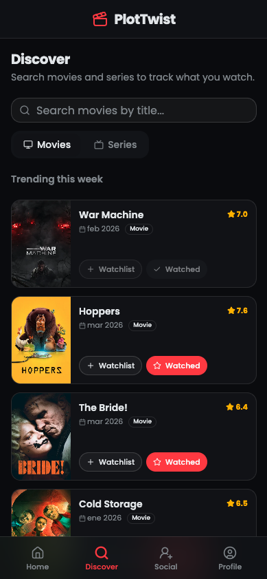
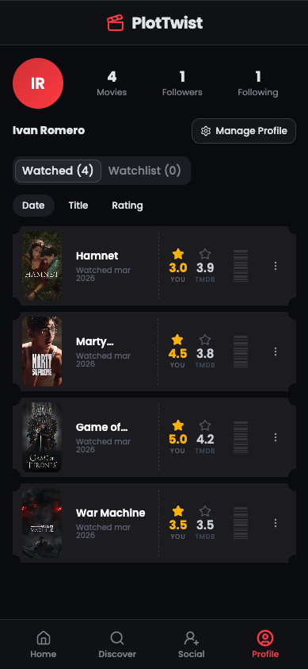

# PlotTwist

*Project in beta.*

**Live at:** [https://plottwist.romerolabs.es/](https://plottwist.romerolabs.es/)

<br/>

<div align="center">
  
  
  
</div>

<br/>

## Objective

**PlotTwist** is a platform designed to let you track, manage, and share your media journey in a highly visual and premium UI context. Keep a pulse on recent activity by browsing through a unified feed of movie-ticket-inspired cards, maintain rich collections of watchlists and watched items, follow other users, and seamlessly discover new movies and series sourced directly from external media providers like TMDB.

The ultimate goal of PlotTwist is to give you a dynamic, highly responsive hub that makes your daily media tracking into an enjoyable and sociable showcase.

## Tech Stack

The architecture relies on a modern, fully-typed full-stack separation, utilizing a blistering fast API backend paired with a stunning, fast, reactive UI.

### Backend (`app/`)

- **Framework**: [FastAPI](https://fastapi.tiangolo.com/) (Python 3.10+)
- **Database**: PostgreSQL with [SQLModel](https://sqlmodel.tiangolo.com/) (Pydantic integration) & [Alembic](https://alembic.sqlalchemy.org/) migrations
- **Authentication**: PyJWT and Argon2/Bcrypt password hashing
- **Environment & Management**: Python dependencies heavily managed via `uv` (using `uv.lock`)
- **Key Architectural Patterns**: Robust dependency injection, decoupled routing, service-level isolation, and abstraction of external media APIs.

### Frontend (`frontend/`)

- **Framework**: [React 19](https://react.dev/) + [Vite](https://vitejs.dev/) with TypeScript
- **State & Routing**: [TanStack Query](https://tanstack.com/query) for asynchronous state management & [TanStack Router](https://tanstack.com/router) for application routing
- **Styling**: [TailwindCSS v4](https://tailwindcss.com/) alongside [Radix UI](https://www.radix-ui.com/) accessible unstyled components
- **Environment & Management**: `bun` workspace management and `biome` for lightning-fast code formatting.

## How to Run Locally

### Prerequisites

1. **[Docker](https://docs.docker.com/get-docker/) & Docker Compose** (for running the database and API components cleanly)
2. **[Bun](https://bun.sh/)** (for frontend packages and workspace scripts)
3. **[uv](https://github.com/astral-sh/uv)** (optional, if you want local execution or testing of the backend outside Docker)

### Setup & Local Development

This project provides helpful `bun` scripts at the root level to seamlessly operate the backend and frontend modules together.

1. **Environment Initialization:**
   Ensure an `.env` file exists in the root directory. You can use `.env.prod.example` as a starting template:

   ```bash
   cp .env.prod.example .env
   # Ensure database credentials, SMTP setup, and tokens are correctly referenced.
   ```

2. **Install Local Dependencies:**

   ```bash
   bun install
   ```

3. **Spawn the Application:**
   To spin up the PostgreSQL container, compile the backend API via `docker compose watch`, and run the Vite frontend preview concurrently, execute:

   ```bash
   bun run dev:all
   ```

   - **Frontend:** Automatically runs on `http://localhost:5173`.
   - **Backend API:** Bound to `http://localhost:8000`, applying hot-reload locally with `docker compose watch`.

Alternatively, use `bun run dev:backend` to run only the backend system, or `bun run dev` to interact exclusively with the frontend.
